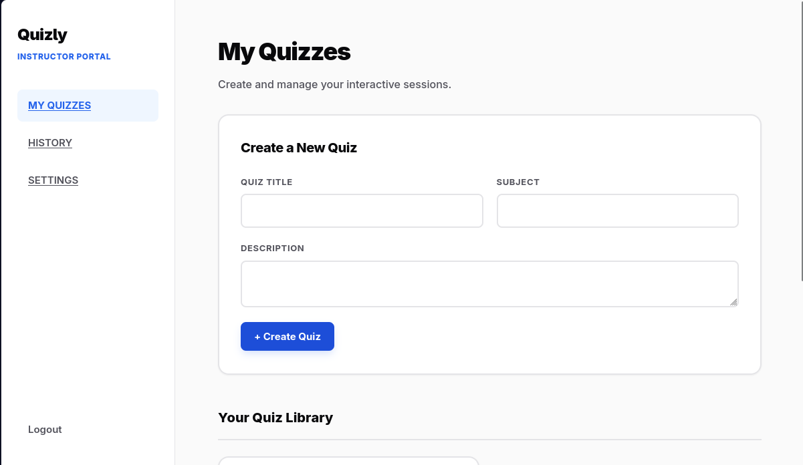
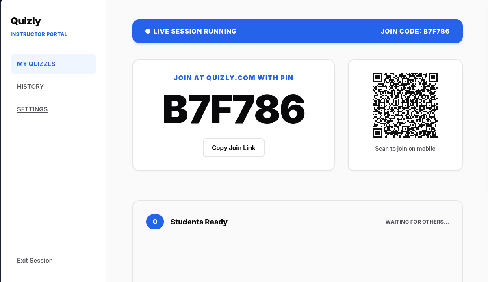
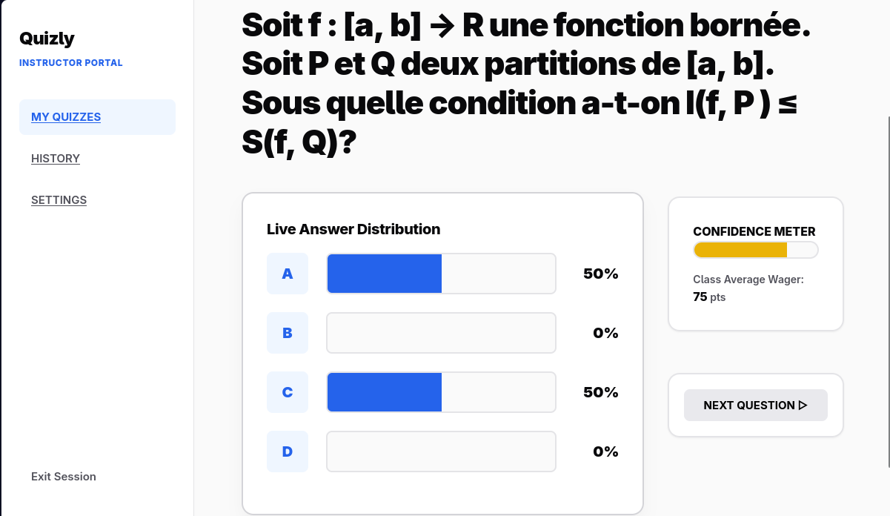
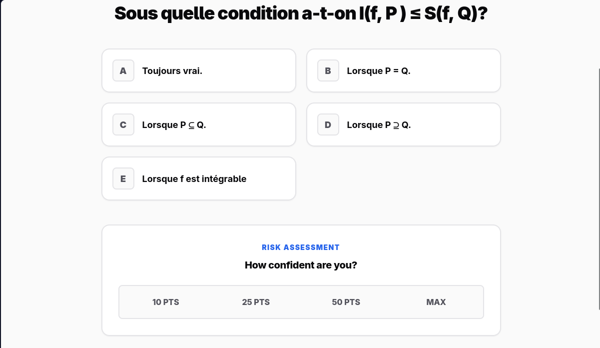

# Quizly | Real-Time Interactive Quiz Engine
> **A high-concurrency Jakarta EE platform for real-time evaluations with Certainty-Based Wagering (CBW).**

## 🎯 Project Overview
Quizly is designed for live, instructor-led classroom environments. Unlike standard quiz apps, it uses a **"Three-Page-in-One" architecture** and **WebSockets** to ensure sub-second synchronization between the host and participants, while evaluating not just knowledge, but student confidence levels.

## 📸 Interface Preview

### Instructor Portal

<br>

<br>


### Student Experience


## 🏆 Key Accomplishments (XYZ Formula)
*   **Optimized Code Maintainability:** Implemented **Command** and **Observable** design patterns to decouple game logic from the communication layer, reducing architectural complexity.
*   **Engineered Real-Time Sync:** Leveraged **Jakarta WebSockets** to achieve sub-second state updates across concurrent student sessions.
*   **Advanced Logic Implementation:** Designed a **Certainty-Based Wagering** system to identify student "lucky guesses" versus mastery, backed by a structured **PostgreSQL** relational model.

## 🛠 Technical Stack
*   **Runtime:** Java 21 / WildFly 30+
*   **Framework:** Jakarta EE 10 (Faces 4.1, CDI 4.1, Servlets 6.1)
*   **Persistence:** Hibernate 7.0 (JPA) & PostgreSQL
*   **Patterns:** Command Pattern, Observable Pattern
*   **Build:** Maven

## 🏗 Architecture & Design Patterns
To ensure a professional-grade codebase, I implemented:
*   **Observable Pattern:** Used to broadcast "Host" events (new questions, timer starts) to all "Student" listeners via the WebSocket bus.
*   **Command Pattern:** Every user action (SubmitAnswer, JoinLobby, Wager) is encapsulated as a Command object, ensuring consistent validation and state updates.

## 🧪 Technical Challenges & Resolutions
### **Resolved: Session Lifecycle & Inactivity Handling**
*   **The Issue:** During testing, students who failed to interact within a 2-minute window were unexpectedly disconnected ("kicked out"), despite Java EE's `Session.setMaxIdleTimeout` being configured for 1 hour.
*   **The Engineering Take:** This highlighted the complexities of **WebSocket session persistence** when dealing with underlying container (WildFly/Undertow) connection limits and reverse proxies.
*   **The Solution:** I engineered a robust **client-side Ping/Pong heartbeat mechanism**. The client now dispatches an asynchronous, low-overhead `{"action": "PING"}` payload every 30 seconds. The server intercepts and silently consumes these keep-alives before they reach the main command dispatcher. This successfully decoupled connection stability from external infrastructure timeouts, ensuring uninterrupted real-time sessions.

---

## ⚙️ Configuration & Local Setup

### 1. Database Setup
Ensure PostgreSQL is running and create the project database:
```sql
CREATE DATABASE quizly_db;
```

### 2. Update Persistence
Modify `src/main/resources/META-INF/persistence.xml`:
*   **JDBC URL:** `jdbc:postgresql://localhost:5432/quizly_db`
*   **Credentials:** Update your `user` and `password`.

### 🏃 Running Locally
1. **Set Environment:**
```bash
export JAVA_HOME=/usr/lib/jvm/java-21-openjdk
export PATH=$JAVA_HOME/bin:$PATH
```
2. **Build & Run:**
```bash
mvn clean install -U
mvn compile wildfly:run
```
3. **Access:** 
*   **App:** `http://localhost:8080/quizly-1.0-SNAPSHOT/`
